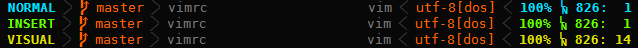

# vim-airline

lean &amp; mean statusline for vim that's light as air

# rationale

there's already [powerline][b], why yet another statusline?

*  it's standard vimscript, no python needed
*  it's small.  i want the entire plugin to be less than 200 lines as a rule
*  it gets you 90% of the way there; in addition to all the standard goodies, it integrates with [vim-bufferline][f], [fugitive][d], and [syntastic][e]
*  it looks good with regular fonts, and provides configuration points so you can use unicode or powerline symbols
*  it's fast to load, taking roughly 1ms.  by comparison, powerline needs 60ms on the same machine.

what about [old powerline][a]?

*  the old version still works well, but since its deprecated new features won't get added

# why's it called airline?

i wrote the initial version on an airplane, and since it's light as air it turned out to be a good name.  thanks for flying vim!

# configuration

`:help airline`

# faq/troubleshooting

1.  the powerline font symbols are not showing up
  *  the older deprecated [vim-powerline][a] uses different codes compared to the newer [powerline][b].
  *  you can grab prepatched fonts at [powerline-fonts][c], or you can manually set the relevant `g:` variables
2.  there is a pause when leaving insert mode
  *  you need to set `ttimeoutlen` to a low number; 50 is recommended
3.  you get the error `Unknown function: fugitive#head`
  *  you are probably using version 1.2, which is very old...download v2 from the [project page][d].

# screenshots

## dark theme with a regular font

## dark theme with the powerline font

## simple theme

## light theme

# contributions

contributions and pull requests are welcome.

# license

`:h license`

[a]: https://github.com/Lokaltog/vim-powerline
[b]: https://github.com/Lokaltog/powerline
[c]: https://github.com/Lokaltog/powerline-fonts
[d]: https://github.com/tpope/vim-fugitive
[e]: https://github.com/scrooloose/syntastic
[f]: https://github.com/bling/vim-bufferline
