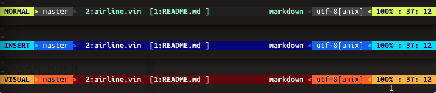
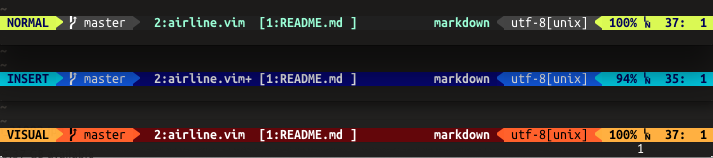

# vim-airline

lean &amp; mean statusline for vim

# rationale

there's already [powerline](https://github.com/Lokaltog/powerline), why yet another statusline?

*  it's standard vimscript, no python needed
*  it's small.  i want the entire plugin to be less than 200 lines as a rule
*  gets you 90% of the way there: in addition to all the standard goodies, supports [fugitve](https://github.com/tpope/vim-fugitive) and [syntastic](https://github.com/scrooloose/syntastic)
*  integration with [vim-bufferline](https://github.com/bling/vim-bufferline)
*  looks good with regular fonts, with support to use powerline font glyths
*  it's fast to load.  since it's so small, it only takes 0.5ms to load.  by comparison, powerline needs 60ms on the same machine.

# why's it called airline?

i wrote this on an airplane, and since it's light as air it turned out to be a good name :-)

# configuration

there are a couple configuration values available:

* `g:airline_left_sep`  the seperator used on the left side
* `g:airline_right_sep`  the seperator used on the right side
* `g:airline_enable_fugitive`  enable/disable fugitive integration
* `g:airline_enable_syntastic`  enable/disable syntastic integration
* `g:airline_theme`  change the theme, currently only `default` is available
* `g:airline_powerline_fonts`  enable/disable usage of patched powerline font symbols

# demo

## regular font

## powerline font

# contributions

contributions and pull requests are welcome.

# license

`:h license`
